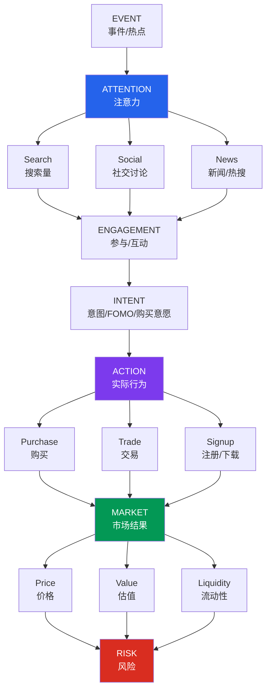
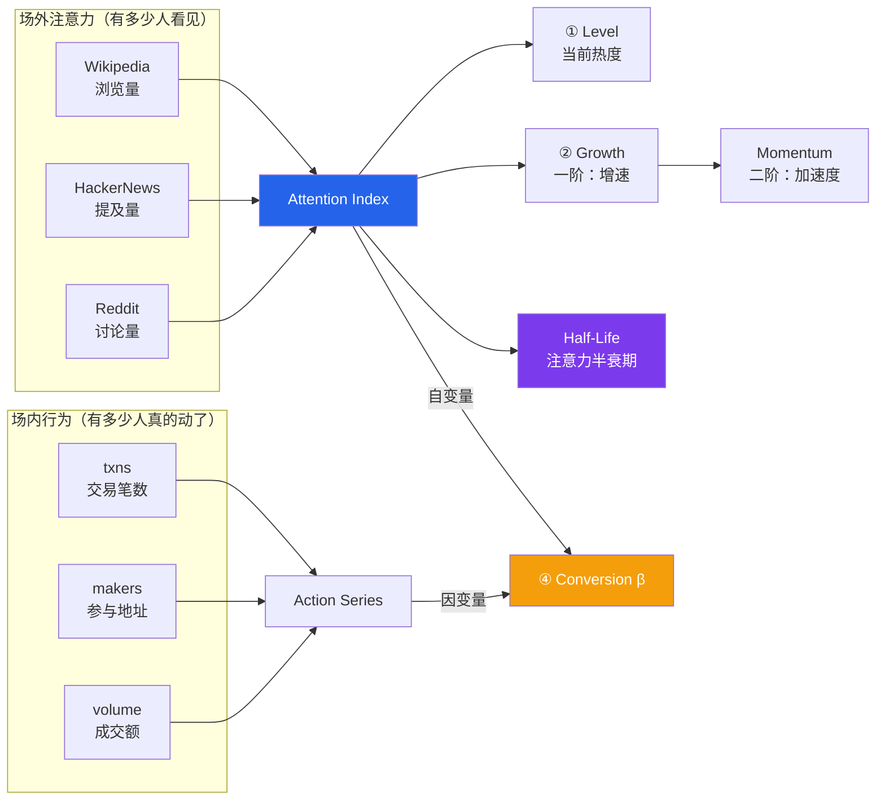
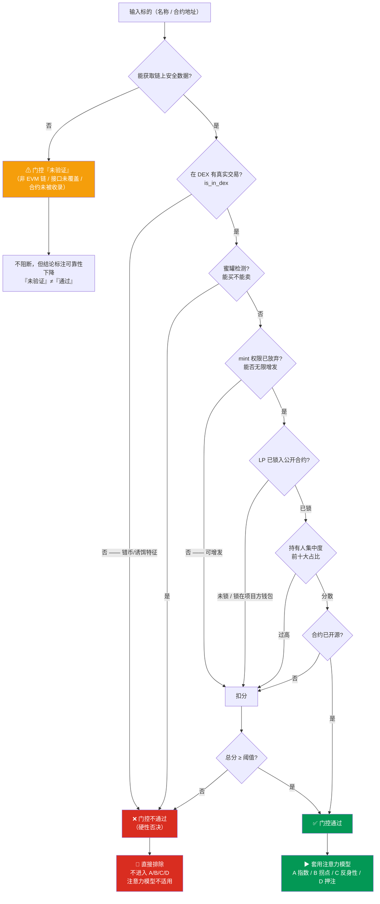

# attention-market

**Attention Market Intelligence**

> An open-source framework for measuring how attention transforms into engagement, behavior,
> market activity, value, and risk.
>
> 一个开源的注意力市场分析框架，用于研究注意力如何转化为参与、行为、市场活动、价值与风险。

Meme 币只是这套框架里**最极端、最容易观察**的一个案例 —— 它的价格几乎完全由注意力驱动，
没有现金流、utility 或赎回权来干扰信号。但同样的链条适用于任何「被注意力定价」的对象。

**它要回答的核心问题只有一个：注意力值多少钱？**

---

## 一、完整模型：Event → Attention → Behavior → Market → Risk



### 同一套逻辑，不同场景

| 场景 | Attention 来源 | Action | Market 结果 |
|------|---------------|--------|------------|
| Meme / Token | 社交、搜索、热搜 | 买入 / 交易 | 价格、市值 |
| 股票 | 新闻、财报、研报 | 买卖 | 股价、成交量 |
| NFT | 社区、KOL | Mint / 竞价 | 地板价 |
| 电商 | 内容曝光、直播 | 下单 | GMV |
| App | 投放、口碑 | 下载 / 注册 | DAU、留存 |
| 游戏 | 讨论、直播 | 注册 / 充值 | 流水 |
| 影视 | 热搜、预告 | 购票 / 观看 | 票房 |
| 品牌 | 社交传播 | 购买 | 销量 |
| 创作者 | 粉丝关注 | 订阅 / 付费 | 收入 |
| 社会事件 | 新闻报道 | 行为改变 | 相关资产重定价 |

---

## 二、注意力如何被量化（模型 A）



**Attention ≠ Action。** 100 万人看到新闻，不代表 100 万人会购买。
因此框架把两者分开测量，并用「注意力弹性 β」连接：

```
β = Δlog(Action) / Δlog(Attention)

β ≥ 0.8   强转化   —— 注意力高效变成行为
β 0.2~0.8 部分转化 —— 有人在围观，有人在行动
β < 0.2   弱转化   —— 注意力停留在外围（看热闹而非想买）
β < 0     背离     —— 注意力上升而行为下降（叫好不叫座）
```

> **关键：价格由「新增注意力 dA/dt」驱动，而非注意力存量 A。**
> 因此最早的预警信号是**二阶导转负** —— 注意力还在涨，但新进场的人开始变少。

---

## 三、链上门控（模型 E）—— 一切分析的前置条件

这是整套框架中**最不该被跳过**的一环。

注意力定价模型只对**真币**成立。在错币、假币、诱饵合约上做注意力量化，
等于给空气定价 —— 无论你的注意力指标算得多精确，结论都是错的。

### 真实案例：一个"买入教程"里的错币

某篇教人购买某 meme 币的教程给出的 BSC 合约
`0x49b79e9250797025f72f44d7286e267bc2a4b9ed`，经链上安全接口实测：

| 字段 | 实际读出值 | 含义 |
|------|-----------|------|
| `token_name` | **Pancake LPs** | 不是任何 meme 币 |
| `token_symbol` | **Cake-LP** | 是 PancakeSwap 的**流动性池份额代币** |
| `holder_count` | **5** | 几乎无人持有 |
| `is_in_dex` | **0** | 根本不在 DEX 交易 |
| `is_mintable` | **1** | 可随时增发 |

也就是说：照着教程去买，买到的只是一个池子份额代币，与目标 meme 币毫无关系。
**连"教学/导流内容"本身都可能是收割环节的一环。**

### 门控判定流程



### 门控结论（硬性规则）

| 门控结论 | 处理 |
|---------|------|
| **不通过** | **直接排除，不进入 A/B/C/D** —— 注意力模型不适用于该标的，任何注意力指标都不解读 |
| **通过** | 才能套用注意力模型（A/B/C/D 全部启用） |
| **未验证** | 不阻断分析，但所有结论标注"可靠性下降"；**"未验证"不等于"通过"** |

硬性否决项（命中即不通过，与总分无关）：**不在 DEX 交易**、**蜜罐（能买不能卖）**。

### 门控能过滤掉什么

- **错币 / 挂羊头卖狗肉** —— 合约真实名称与宣称的名称不符（如上述 Cake-LP 案例）
- **假币 / 同名诱饵** —— 蹭热点创建的同名合约，把人导流到错误地址
- **蜜罐合约** —— 能买不能卖，进去就出不来
- **可无限增发** —— 供应量随时被稀释
- **未锁 LP 的 rug pull 风险** —— 池子真钱可被随时抽走
- **高度控盘** —— 名义流通，实际筹码集中在少数地址

---

## 四、五个基础指数

| # | 指数 | 回答的问题 |
|---|------|-----------|
| ① | **Attention Index (AI)** | 现在有多少人在关注？ |
| ② | **Attention Momentum** | 关注度在加速还是减速？（Level / Growth / Momentum 三层） |
| ③ | **Engagement Index** | 关注之后，有多少人真的参与了？ |
| ④ | **Conversion Index (β)** | 注意力有没有转化成实际行为？ |
| ⑤ | **Market Response** | 市场对这些注意力作出了什么反应？ |

### Attention × Market 四象限

| | 市场上涨 | 市场下跌 |
|---|---------|---------|
| **注意力 ↑** | 🔥 **Expansion**<br/>注意力驱动型增长，事件扩散期 | ⚠️ **Divergence**<br/>注意力在涨但市场不买账，预期落空 |
| **注意力 ↓** | ⚠️ **Speculation**<br/>价格脱离注意力基础，投机/控盘主导 | ❄️ **Decay**<br/>注意力与市场同步衰退，进入冷却 |

### Attention Half-Life

注意力从峰值衰减到 50% 所需时间 —— 它把"热度"变成可比较的时间尺度：

| 事件类型 | 典型 Half-Life |
|---------|---------------|
| 突发新闻 | 小时级 |
| 明星事件 | 天级 |
| 影视作品 | 周级 |
| 品牌事件 | 月级 |
| 科技趋势 | 月 / 年级 |

### 注意力生命周期

| 阶段 | 注意力 A | 增速 dA/dt | 加速度 d²A/dt² | 价格 | 市场行为 |
|------|---------|-----------|---------------|------|---------|
| 事件出现 | ↑ | >0 | >0 加速 | 起步 | 早期资金进入 |
| 热搜发酵 | ↑↑ | 最大 | ≈0 | ↑↑ | FOMO 启动 |
| 全网传播 | ↑↑↑ | 仍 >0 | **转负 ⚠** | ↑↑↑ | 大量追涨（**顶部预警区**） |
| 热度见顶 | 峰值 | =0 | <0 | **峰值** | 新增买盘枯竭 |
| 注意力下降 | ↓ | <0 | 收敛 | ↓↓ | 开始出逃 |
| 热点消失 | ↓↓↓ | 深负 | 收敛 | ↓↓↓ | 流动性崩塌 |

> 最灵敏的读数不是 A 的大小，而是 **dA/dt 的斜率变化**。
> 当增速开始放缓、而价格仍在冲高时，恰恰是最危险的区间。

---

## 五、快速开始

```bash
pip install -r requirements.txt

# 按名称分析（自动检索 + 链上门控 + 注意力量化）
python -m attention_market analyze "我的女友景甜"

# 指定合约与链（推荐：避免同名混淆）
python -m attention_market analyze --contract 0x6982...1933 --chain ethereum

# 生成 HTML 报告
python -m attention_market analyze "PEPE" --html report.html

# 离线演示（不联网，内置合成数据）
python -m attention_market demo --html demo.html

# JSON 输出（供下游研究）
python -m attention_market analyze "PEPE" --json out.json
```

终端输出示例：

```
═══ Attention Market Intelligence ═══
  标的：Pepe   （查询词：PEPE）
  Chain: ethereum   DEX: uniswap   Contract: 0x6982…1933

  [E] 链上门控
      得分 75/100   通过
      ✗ LP 由项目方地址控制（可随时抽池）

  [A] Attention Index
      Level 40.6/100
      Growth(1阶) -12.4%   Momentum(2阶) -3.1%   → 衰退

  [C] Conversion（注意力 → 行为）
      弹性 β = —   判定：unavailable

  [M] Attention × Market 象限
      → ❄️ 同步衰退

  [H] Attention Half-Life
      t½ = 56.4 小时   事件类型：celebrity

  [R] Risk   风险分 41/100   等级：中
```

---

## 六、架构

```
src/attention_market/
├── cli.py                 命令行入口：analyze / demo
├── core/
│   ├── models.py          数据模型（Snapshot / Series / Result）
│   ├── attention.py       Attention Index：Level / Growth / Momentum
│   ├── halflife.py        指数衰减拟合 → Attention Half-Life
│   ├── conversion.py      注意力弹性 β（Attention → Action）
│   ├── quadrant.py        Attention × Market 四象限
│   ├── gate.py            链上门控（错币 / 蜜罐 / LP / mint / 集中度）
│   ├── risk.py            综合风险评分
│   └── pipeline.py        主流水线：Event → Attention → Action → Market → Risk
├── providers/             可插拔数据源（全部可降级）
│   ├── dexscreener.py     市场快照（多链，免费）
│   ├── geckoterminal.py   OHLCV 历史序列（免费）
│   ├── goplus.py          合约安全检测（门控数据来源，免费）
│   ├── onchain_activity.py 场内行为代理：txns / makers / volume
│   └── web_attention.py   场外注意力代理：Wikipedia / HackerNews / Reddit
├── reporting/             console / html / json 三种输出
└── utils/                 http（重试 + 降级）、normalize、config
```

### 设计原则

1. **免费优先、零配置可跑** —— 默认只使用无需 API Key 的公开数据源。
2. **Provider 可插拔 + 优雅降级** —— 任一数据源失败，指标标记为 `unavailable` 而非崩溃。
3. **门控前置、不通过即排除** —— 错币/假币/诱饵合约上不做任何注意力解读。
4. **诚实标注** —— 明确区分「已核实」「代理指标」「未验证」「数据缺失」，不把推测写成事实。

### 数据源与局限

| Provider | 用途 | Key | 说明 |
|----------|------|-----|------|
| DexScreener | 价格 / 流动性 / 成交量 / 交易数 | 免费 | 覆盖多链，含 TRON |
| GeckoTerminal | OHLCV 历史序列 | 免费 | 部分链不支持，缺失时降级为快照模式 |
| GoPlus | 蜜罐 / mint / LP 锁仓 / 持有人 | 免费 | 仅 EVM 链；非 EVM 时门控标记「未验证」 |
| Wikipedia Pageviews | 场外注意力代理 | 免费 | 仅对有人物/事件条目的对象有效 |
| Hacker News | 场外注意力代理 | 免费 | 偏科技 / crypto 话题 |
| Reddit | 场外注意力代理 | 免费 | 默认关闭（限流），可在 config 启用 |

> ⚠️ 「注意力」在本框架中是**间接代理指标（proxy）**，不是全网注意力的直接测量。
> 搜索量、讨论量、浏览量都可能被刷量、水军、付费推广污染 ——
> 指标的用途是**诊断与比较**，不是预测。

---

## 七、工程笔记：五个关键教训

这些是实盘跑数据时踩出来的坑，每一个都会**静默地产出错误结论**：

**1. Growth / Momentum 必须在原始信号上算，不能在标定后的指数上。**
Attention Index 为便于横向比较做了 log10 压缩 + 截断到 0-100，
这一变换会把原始信号 75% 的涨幅压成指数上 24% 的涨幅 —— 真实动态被严重低估。
因此：**Level 用标定指数（可横向比），Growth/Momentum 用各信号自身变化率的加权平均（保真实动态）**。

**2. 半衰期必须在原始信号上拟合，否则会被系统性高估。**
log 标定会把**指数衰减压成线性衰减**，在其上拟合 λ 得到的半衰期严重偏大
（实测：真实 t½=67h 的序列，在标定指数上拟合出 186h，误差近 3 倍）。
跨量纲信号聚合必须用**加权几何平均**而非算术平均 —— 几何聚合保持乘性变化率。

**3. 「拿不到数据」绝不能显示成「通过」。**
当安全接口不覆盖某条链（如 TRON）时，门控若默认给 100 分，等于发放虚假安全感。
本项目用 `score=None` + `verified=False` 显式区分：**未验证 ≠ 通过**，
并进一步区分原因（未收录 / 非 EVM 链 / 接口失败）—— 「未被收录」本身就是风险信号。

**4. 最后一根日线 K 是「当日未走完」的 candle。**
GeckoTerminal 返回的最新日线只累计了几小时成交量，
直接采用会让 Growth 出现 -90% 量级的假信号。本项目默认丢弃该根并显式标注。

**5. 同名标的是常态，不是例外。**
一次查询返回多个同名合约是普遍现象（"我的女友景甜"返回 6 个，横跨 bsc / tron / robinhood）。
因此工具**必须列出候选**并强制用户用 `--chain` / `--contract` 精确指定，
而不是默默挑流动性最高的那个。

---

## 八、路线图

- [ ] 更多 Attention Provider（Google Trends、X/Twitter、Telegram、微博指数）
- [ ] 多对象横向对比（`compare` 命令：同一事件下的多个标的）
- [ ] 事件标注数据集（热点事件 → 注意力曲线 → 市场结果的完整案例库）
- [ ] 非加密场景适配（股票、App、影视票房的 Attention→Action 映射）
- [ ] Web Dashboard（时间序列可视化 + 背离预警）
- [ ] 门控规则扩展（更多链、更多安全信号源）

---

## 免责声明

本项目是**研究与分析框架**，不是投资工具，不提供任何投资建议。

- 加密货币相关功能仅用于链上数据核查与风险教育。我国明确禁止虚拟货币交易炒作，
  相关代币不受法律保护，参与即自负全部损失。
- 所有注意力指标为间接代理，可被操纵，不应作为任何决策的唯一依据。
- 门控通过**不代表该标的安全或无风险**，它只表示「未发现硬性否决项」。

---

## License

MIT — 见 [LICENSE](LICENSE)。
