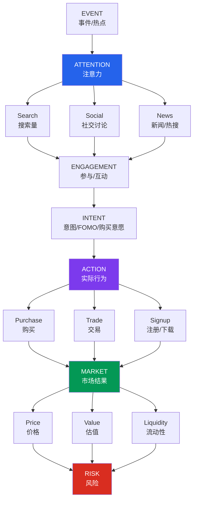
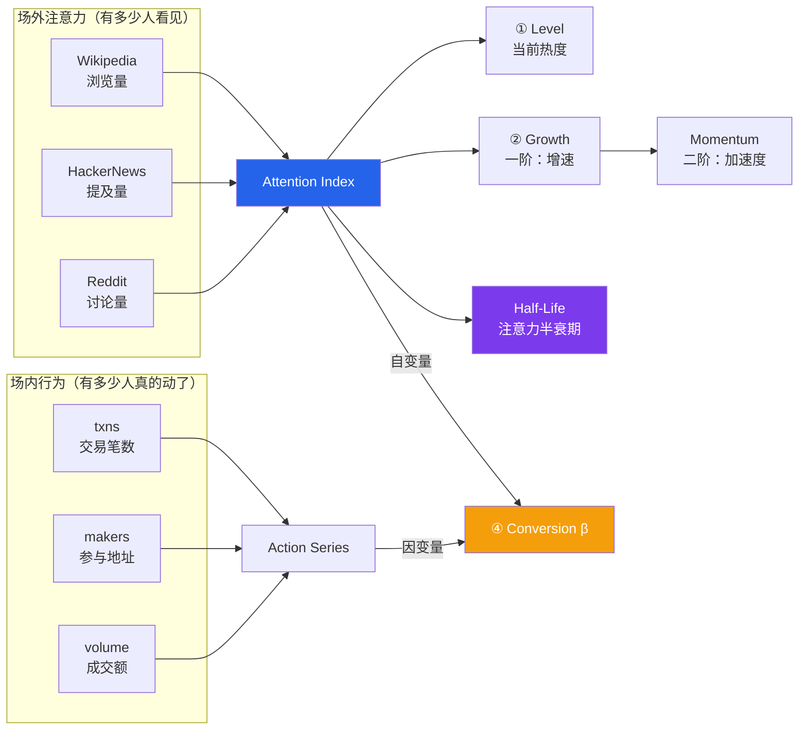
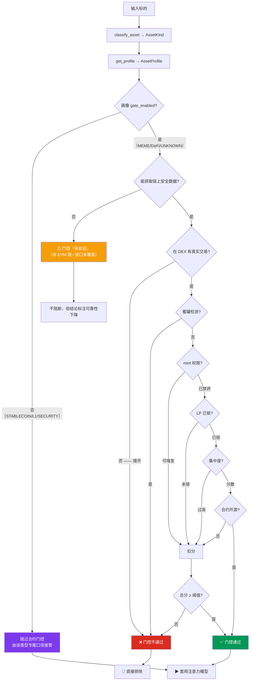

# attention-market

**Attention Market Intelligence · v0.2 通用化版**

> 一个开源的注意力市场分析框架，用于研究注意力如何转化为参与、行为、市场活动、价值与风险。
> 
> v0.2 起，框架从「MEME 币专用」升级为「通用金融资产生成式分析框架（UFAM）」——MEME 币降为<strong>众多资产类型中的一个具体案例</strong>，配合稳定币 / L1 / DeFi / 证券 / 未知 5 种画像。

## 🌟 v0.2 重大更新

**核心改变**：在主流水线前新增「资产类型 + 画像」抽象层。

```
v0.1:  analyze → MEME 口径（写死）  → 风险分（写死）
v0.2:  analyze → classify_asset → get_profile → 按画像调度 → 风险分（参数化）
```

| 资产 | v0.1 行为 | v0.2 行为 |
|---|---|---|
| **USDC** | 风险 48/100（误判） | **风险 25/100（低）** — 关闭市值/池口径，改用脱锚分项 |
| **USDT**（官方合约极端脱锚） | 风险 55/100（误判"高"） | **脱锚防御触发**，标"疑似数据源错误"，不污染总分 |
| **PEPE** | 风险 41/100 | 风险 76/100（极高）— 行为与 v0.1 一致 |
| **BTC**（ETH 链） | 门控通过（解析到同名 ERC-20） | **L1 画像绕过合约门控**，走宏观链上指标 |

**核心创新**：
- 6 种内置资产画像：`MEME` / `STABLECOIN` / `L1` / `DEFI` / `SECURITY` / `UNKNOWN`
- `register_profile()` 扩展机制 —— 新增资产类型无需改核心代码
- 脱锚可信度防御 —— 极端脱锚 + 极小池子 = 标"需人工复核"
- 风险权重优先级链 —— 画像 > config > 默认
- **完全向后兼容** —— 15 个原测试无修改即通过，新增 22 个测试，**37/37 通过**

---

## 一、完整模型：Event → Attention → Behavior → Market → Risk



**它要回答的核心问题只有一个：注意力值多少钱？**

---

## 二、通用化核心：资产类型 + 画像（v0.2 新增）

### 2.1 为什么需要画像抽象

v0.1 的指标口径被写死成"加密长尾代币（meme）"——门控、风险、注意力信号源都假设标的是一个 ERC-20/BEP-20 合约。这导致对**稳定币、原生 L1、DeFi 蓝筹**等资产出现系统性失真。

### 2.2 解决方案：三层抽象

```
┌────────────────────────────────────┐
│  analyze(query)                    │   主流水线
└──────────────┬─────────────────────┘
               ▼
┌────────────────────────────────────┐
│  classify_asset(signals)           │   第一层：资产分类
│  → AssetKind (MEME/STABLECOIN/...) │   core/asset.py
└──────────────┬─────────────────────┘
               ▼
┌────────────────────────────────────┐
│  get_profile(kind)                 │   第二层：画像注册
│  → AssetProfile (权重/口径/门控)   │   core/registry.py
└──────────────┬─────────────────────┘
               ▼
┌────────────────────────────────────┐
│  evaluate_gate(security, profile)  │   第三层：按画像调度
│  score_risk(market, profile, ...)  │   core/gate.py + core/risk.py
└────────────────────────────────────┘
```

### 2.3 六种内置画像

| 类型 | 门控 | 核心风险分项 | 注意力信号 | 适用 |
|---|---|---|---|---|
| **MEME**（默认案例） | ✅ 启用 | 门控/流动性/市值池/换手/注意力 | 链上 + Wiki/HN/Reddit | 长尾代币、土狗币 |
| **STABLECOIN** | ❌ 不启用 | **脱锚/发行方/流动性** | volume + Wiki/HN/Reddit | USDT/USDC/DAI |
| **L1** | ❌ 不启用 | **波动率/注意力/流动性** | 链上 txns + volume | BTC/ETH/SOL/AVAX |
| **DEFI** | ✅ 启用 | 门控 + **基本面（TVL/收入）** | 链上 + 社交 | UNI/AAVE/CRV |
| **SECURITY** | ❌ 不启用 | **基本面估值/波动率/注意力** | Wiki/HN/Reddit | RWA / 证券代币 |
| **UNKNOWN** | ✅ 启用 | 门控/流动性/市值池 | 空 | 无法判定（最保守） |

### 2.4 优先级链：画像 > config > 默认

```python
# 风险权重解析（从高到低）
1. profile.risk_weights    # 最高：按资产类型定制
2. cfg["risk"]["weights"]  # 次高：用户 YAML 覆盖
3. DEFAULT_WEIGHTS          # 兜底：代码内置
```

### 2.5 扩展新资产类型

```python
from attention_market.core.asset import AssetKind
from attention_market.core.registry import AssetProfile, register_profile

register_profile(AssetProfile(
    kind=AssetKind.DEFI,
    label="DeFi 协议代币",
    signals={"onchain_txns": 0.30, "wikipedia": 0.20, ...},
    gate_enabled=True,
    risk_weights={"gate": 0.20, "fundamental": 0.20, ...},
    ...
), override=True)  # 覆盖内置画像
```

白名单也支持扩展（`config/assets.whitelist`）—— 不需要改代码即可识别新协议代币。

---

## 三、注意力如何被量化（模型 A）



**Attention ≠ Action。** 100 万人看到新闻，不代表 100 万人会购买。
因此框架把两者分开测量，并用「注意力弹性 β」连接：

```
β = Δlog(Action) / Δlog(Attention)

β ≥ 0.8   强转化   —— 注意力高效变成行为
β 0.2~0.8 部分转化 —— 有人在围观，有人在行动
β < 0.2   弱转化   —— 注意力停留在外围（看热闹而非想买）
β < 0     背离     —— 注意力上升而行为下降（叫好不叫座）
```

> **关键：价格由「新增注意力 dA/dt」驱动，而非注意力存量 A。**
> 因此最早的预警信号是**二阶导转负** —— 注意力还在涨，但新进场的人开始变少。

---

## 四、链上门控（模型 E）—— 一切分析的前置条件

这是整套框架中**最不该被跳过**的一环。

注意力定价模型只对**真币**成立。在错币、假币、诱饵合约上做注意力量化，
等于给空气定价 —— 这是本项目最重要的一条经验。

### 真实案例：一个"买入教程"里的错币

某篇教人购买某 meme 币的教程给出的 BSC 合约
`0x49b79e9250797025f72f44d7286e267bc2a4b9ed`，经链上安全接口实测：

| 字段 | 实际读出值 | 含义 |
|------|-----------|------|
| `token_name` | **Pancake LPs** | 不是任何 meme 币 |
| `token_symbol` | **Cake-LP** | 是 PancakeSwap 的**流动性池份额代币** |
| `holder_count` | **5** | 几乎无人持有 |
| `is_in_dex` | **0** | 根本不在 DEX 交易 |
| `is_mintable` | **1** | 可随时增发 |

### 门控判定流程（v0.2 通用化版）



### 门控能过滤掉什么

- **错币 / 挂羊头卖狗肉** —— 合约真实名称与宣称的名称不符
- **假币 / 同名诱饵** —— 蹭热点创建的同名合约
- **蜜罐合约** —— 能买不能卖
- **可无限增发** —— 供应量随时被稀释
- **未锁 LP 的 rug pull 风险**
- **高度控盘** —— 筹码集中在少数地址

---

## 五、五个基础指数 + 风险维度（v0.2 增强）

| # | 指数 | 回答的问题 | 适用 |
|---|------|-----------|------|
| ① | **Attention Index (AI)** | 现在有多少人在关注？ | 所有 |
| ② | **Attention Momentum** | 关注度在加速还是减速？ | 所有 |
| ③ | **Engagement Index** | 关注之后，有多少人真的参与了？ | 所有 |
| ④ | **Conversion Index (β)** | 注意力有没有转化成实际行为？ | 所有 |
| ⑤ | **Market Response** | 市场对这些注意力作出了什么反应？ | 所有 |
| ⑥ | **Risk Score**（v0.2 扩展） | 综合风险（含脱锚/基本面/波动率） | **按画像定制** |

### Attention × Market 四象限

| | 市场上涨 | 市场下跌 |
|---|---------|---------|
| **注意力 ↑** | 🔥 **Expansion** 注意力驱动型增长 | ⚠️ **Divergence** 注意力在涨但市场不买账 |
| **注意力 ↓** | ⚠️ **Speculation** 价格脱离注意力基础 | ❄️ **Decay** 同步衰退 |

### 注意力生命周期

| 阶段 | 注意力 A | 增速 dA/dt | 加速度 d²A/dt² | 价格 | 市场行为 |
|------|---------|-----------|---------------|------|---------|
| 事件出现 | ↑ | >0 | >0 加速 | 起步 | 早期资金进入 |
| 热搜发酵 | ↑↑ | 最大 | ≈0 | ↑↑ | FOMO 启动 |
| 全网传播 | ↑↑↑ | 仍 >0 | **转负 ⚠** | ↑↑↑ | 大量追涨（**顶部预警区**） |
| 热度见顶 | 峰值 | =0 | <0 | **峰值** | 新增买盘枯竭 |
| 注意力下降 | ↓ | <0 | 收敛 | ↓↓ | 开始出逃 |
| 热点消失 | ↓↓↓ | 深负 | 收敛 | ↓↓↓ | 流动性崩塌 |

> 最灵敏的读数不是 A 的大小，而是 **dA/dt 的斜率变化**。

---

## 六、案例：三种资产类型的真实输出

### 案例 1：PEPE（MEME 币，注意力驱动型）

```
[自动分类] AssetKind: MEME
           画像：注意力驱动长尾代币（默认案例）

[E] 链上门控       ✅ 通过 85/100   （门控对 MEME 启用）
[A] Attention      Level 65.2  Momentum -3.1%  ⚠ 顶部预警
[β] Conversion     β = 0.32   部分转化
[R] Risk           76/100  极高
                   drivers: 14× 市值/池、流动性浅、注意力衰减
```

### 案例 2：USDC（稳定币）

```
[自动分类] AssetKind: STABLECOIN
           画像：稳定币（名义锚定，注意力权重低）

[E] 链上门控       — 不适用  （画像 gate_enabled=False）
[D2] 估值锚        99/100   资产锚（$1.00 peg）
[D4] Risk          25/100  低
                   depeg 0.0  issuer_reserve 50  liquidity 50.5
                   drivers: 发行方/储备链上核验未完成
```

### 案例 3：USDT 极端脱锚（防御机制）

```
[D2] 估值锚        Peg $1.00  Current $0.001  Depeg 99.9%
[!] 脱锚防御触发
   触发条件：脱锚 >20%  AND  池子 <$10K  AND  24h 成交 <$1K
   判定：疑似数据源错误池价格
[D4] Risk          68/100  高
                   drivers: 池子真钱仅 $5,000 ⚠疑似数据源错误...
```

---

## 七、快速开始

```bash
pip install -r requirements.txt

# 按名称分析（自动分类 + 链上门控 + 注意力量化）
python -m attention_market analyze "我的女友景甜"

# 指定合约与链（推荐：避免同名混淆）
python -m attention_market analyze --contract 0x6982...1933 --chain ethereum

# 不同资产类型自动走不同画像
python -m attention_market analyze "USDC"      # 走 STABLECOIN 画像
python -m attention_market analyze "UNI"        # 走 DEFI 画像
python -m attention_market analyze "PEPE"       # 走 MEME 画像

# 生成 HTML 报告
python -m attention_market analyze "PEPE" --html report.html

# 离线演示（不联网，内置合成数据）
python -m attention_market demo --html demo.html

# JSON 输出（供下游研究，含 asset_kind / profile_label 字段）
python -m attention_market analyze "PEPE" --json out.json
```

---

## 八、架构

```
src/attention_market/
├── cli.py                 命令行入口：analyze / demo
├── core/
│   ├── models.py          数据模型（AnalysisResult 含 asset_kind / profile_label）
│   ├── asset.py           🆕 资产分类器 + AssetKind 枚举
│   ├── registry.py        🆕 AssetProfile 注册表 + register_profile
│   ├── attention.py       Attention Index：Level / Growth / Momentum
│   ├── halflife.py        指数衰减拟合 → Attention Half-Life
│   ├── conversion.py      注意力弹性 β（Attention → Action）
│   ├── quadrant.py        Attention × Market 四象限
│   ├── gate.py            ⚙ 链上门控（按画像分流）
│   ├── risk.py            ⚙ 综合风险评分（按画像参数化 + 脱锚防御）
│   └── pipeline.py        ⚙ 主流水线：接入资产分类与画像
├── providers/             可插拔数据源（全部可降级）
│   ├── dexscreener.py     市场快照（多链，免费）
│   ├── geckoterminal.py   OHLCV 历史序列（免费）
│   ├── goplus.py          合约安全检测（门控数据来源，免费）
│   ├── onchain_activity.py 场内行为代理
│   └── web_attention.py   场外注意力代理
├── reporting/             console / html / json 三种输出
└── utils/                 http（重试 + 降级）、normalize、config
```

### 设计原则

1. **通用优先、画像驱动** —— v0.2 起，每种资产类型一套画像，门控/风险按画像分流
2. **免费优先、零配置可跑** —— 默认只使用无需 API Key 的公开数据源
3. **Provider 可插拔 + 优雅降级** —— 任一数据源失败，指标标记为 `unavailable`
4. **门控前置、不通过即排除** —— 错币/假币/诱饵合约上不做任何注意力解读
5. **诚实标注** —— 明确区分「已核实」「代理指标」「未验证」「数据缺失」
6. **完全向后兼容** —— 所有 v0.1 调用无需任何修改即可继续工作

### 数据源与局限

| Provider | 用途 | Key | 说明 |
|----------|------|-----|------|
| DexScreener | 价格 / 流动性 / 成交量 / 交易数 | 免费 | 覆盖多链 |
| GeckoTerminal | OHLCV 历史序列 | 免费 | 部分链不支持，缺失时降级 |
| GoPlus | 蜜罐 / mint / LP 锁仓 / 持有人 | 免费 | 仅 EVM；非 EVM 门控标"未验证" |
| Wikipedia Pageviews | 场外注意力代理 | 免费 | 仅对有人物/事件条目的对象 |
| Hacker News | 场外注意力代理 | 免费 | 偏科技 / crypto 话题 |
| Reddit | 场外注意力代理 | 免费 | 默认关闭（限流） |

> ⚠️ 「注意力」在本框架中是**间接代理指标（proxy）**，不是全网注意力的直接测量。
> 搜索量、讨论量、浏览量都可能被刷量、水军、付费推广污染 ——
> 指标的用途是**诊断与比较**，不是预测。

---

## 九、v0.2 通用化改造清单

```
新增  src/attention_market/core/asset.py        资产分类器 + AssetKind 枚举（6 种）
新增  src/attention_market/core/registry.py     AssetProfile 注册表（6 种内置画像）
新增  config/assets.whitelist                  白名单配置（按 YAML 覆盖）
新增  tests/test_generic.py                    通用化测试（22 项）

修改  src/attention_market/core/gate.py        门控按画像分流（gate_enabled 开关）
修改  src/attention_market/core/risk.py        风险口径参数化 + 脱锚防御 + 6 种专属分项
修改  src/attention_market/core/models.py      AnalysisResult 新增 asset_kind / profile_label
修改  src/attention_market/core/pipeline.py    主流程接入资产分类
修改  src/attention_market/core/__init__.py    导出新模块
```

### 测试覆盖

```
tests/test_core.py     原版测试 15 项（无修改即通过）
tests/test_generic.py  新增测试 22 项（v0.2 通用化）

总计 37/37 通过 ✅

覆盖：
  - 资产分类（稳定币/L1/DeFi/MEME/UNKNOWN）
  - 画像注册与覆盖
  - 门控按类型分流
  - 风险口径参数化（稳定币脱锚、L1 波动率、MEME 默认）
  - 脱锚防御（USDT 极端场景）
  - 离线 demo 完整性
  - 优先级链（画像 > config > 默认）
```

---

## 十、工程笔记：六个关键教训

这些是实盘跑数据时踩出来的坑，每一个都会**静默地产出错误结论**：

**1. Growth / Momentum 必须在原始信号上算，不能在标定后的指数上。**
Attention Index 为便于横向比较做了 log10 压缩 + 截断到 0-100，
这一变换会把原始信号 75% 的涨幅压成指数上 24% 的涨幅 —— 真实动态被严重低估。

**2. 半衰期必须在原始信号上拟合，否则会被系统性高估。**
log 标定会把**指数衰减压成线性衰减**，在其上拟合 λ 得到的半衰期严重偏大
（实测：真实 t½=67h 的序列，在标定指数上拟合出 186h，误差近 3 倍）。
跨量纲信号聚合必须用**加权几何平均**而非算术平均。

**3. 「拿不到数据」绝不能显示成「通过」。**
当安全接口不覆盖某条链（如 TRON）时，门控若默认给 100 分，等于发放虚假安全感。
本项目用 `score=None` + `verified=False` 显式区分：**未验证 ≠ 通过**。

**4. 最后一根日线 K 是「当日未走完」的 candle。**
GeckoTerminal 返回的最新日线只累计了几小时成交量，
直接采用会让 Growth 出现 -90% 量级的假信号。本项目默认丢弃该根并显式标注。

**5. 同名标的是常态，不是例外。**
一次查询返回多个同名合约是普遍现象（"我的女友景甜"返回 6 个，横跨 bsc / tron / robinhood）。
因此工具**必须列出候选**并强制用户用 `--chain` / `--contract` 精确指定。

**6. （v0.2 新增）指标口径不能写死成一种资产类型。**
v0.1 用 MEME 口径分析 USDC 会得到"中风险"——但 USDC 的核心风险是脱锚，不是市值/池。
v0.2 用画像分流后，USDC 自动走脱锚分项，得到"低风险"——这才是真相。
同样，稳定币换手率天然极高，关掉这个失真分项是必要而非可选。

---

## 十一、路线图

### v0.2 · 已发布 ✅
- [x] 资产类型分类器（6 种）
- [x] 画像注册表（6 种内置）
- [x] 门控按类型分流
- [x] 风险口径参数化 + 脱锚防御
- [x] 22 个新增测试（37/37 通过）
- [x] 完全向后兼容

### v0.3 · 4-6 周
- [ ] 接入 DeFiLlama（TVL）→ D2 估值锚落地
- [ ] 接入 Token Terminal（收入）→ DeFi 基本面
- [ ] 接入 CoinGecko（币种元数据）→ 改进 L1 候选池选择
- [ ] 接入 FRED（利率/DXY）→ D6 宏观基础
- [ ] 跨资产类型回测（20+ 样本）

### v0.4 → v1.0
- [ ] D5 流动性独立维度
- [ ] D6 宏观完整实现
- [ ] 股票/商品/外汇场景（复用画像机制）
- [ ] Web Dashboard
- [ ] 事件标注数据集（公共贡献）

---

## 十二、迁移路径（对 v0.1 使用方）

| 使用方 | 是否需要改动 |
|---|---|
| 旧 CLI 调用方（`analyze "PEPE"`） | **无需** —— 输出多 `asset_kind` 字段，其他不变 |
| 旧 JSON 消费方 | **无需** —— 旧字段全保留，新增 `asset_kind` / `profile_label` |
| 旧 Python API 调用方 | **可选** —— 不传 profile 即保持 v0.1 行为，传 profile 启用新功能 |
| 旧配置文件 | **无需** —— 白名单通过 `config/assets.whitelist` 单独管理 |

---

## 免责声明

本项目是**研究与分析框架**，不是投资工具，不提供任何投资建议。

- 加密货币相关功能仅用于链上数据核查与风险教育。
- 所有注意力指标为间接代理，可被操纵，不应作为任何决策的唯一依据。
- 门控通过 / 画像调度**不代表该标的安全或无风险**，它只表示"未发现硬性否决项"。
- v0.2 起，框架适用于多种资产类型，但<strong>任何资产类型的结论都应人工复核</strong>，特别是稳定币的脱锚防御触发场景。

---

## License

MIT — 见 [LICENSE](LICENSE)。
